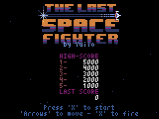
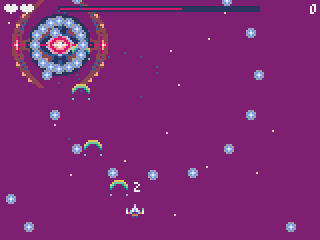

# The last space fighter

A little space shooter game made with [pyxel](https://github.com/kitao/pyxel).


Originally inspired by the [«Defenders of the weeping Quasar»](https://ianmaclarty.itch.io/defenders) of Ian MacLarty, this game has evolved into its own destiny. For the moment only two levels are available ... But will you be able to defend the planet earth until the very end ? Remember, you are humanity's last hope...

 

## Modifications

This version is modified in order to output the image on an LED matrix with 192x128 pixels. The output is done via Flaschen-Taschen UDP protocol.

## Requirements

You need [install Pyxel from Kitao](https://github.com/kitao/pyxel#how-to-install).

## Installation from sources

```bash
git clone https://github.com/yuiio/last-space-fighter.git
cd last-space-fighter/src
python shooter.py
```

## How to play

Keys to play :

- up, down, left right arrows to move
- x to fire
- p to toggle pause
- q to quit
- alt + enter to toggle fullscreen mode

## License

This project is licensed under the terms of [MIT License](LICENSE).

The project contains a modified version of the [Flaschen-Taschen python library](https://github.com/hzeller/flaschen-taschen/blob/master/api/python/flaschen.py) which is licensed under GPL2.
